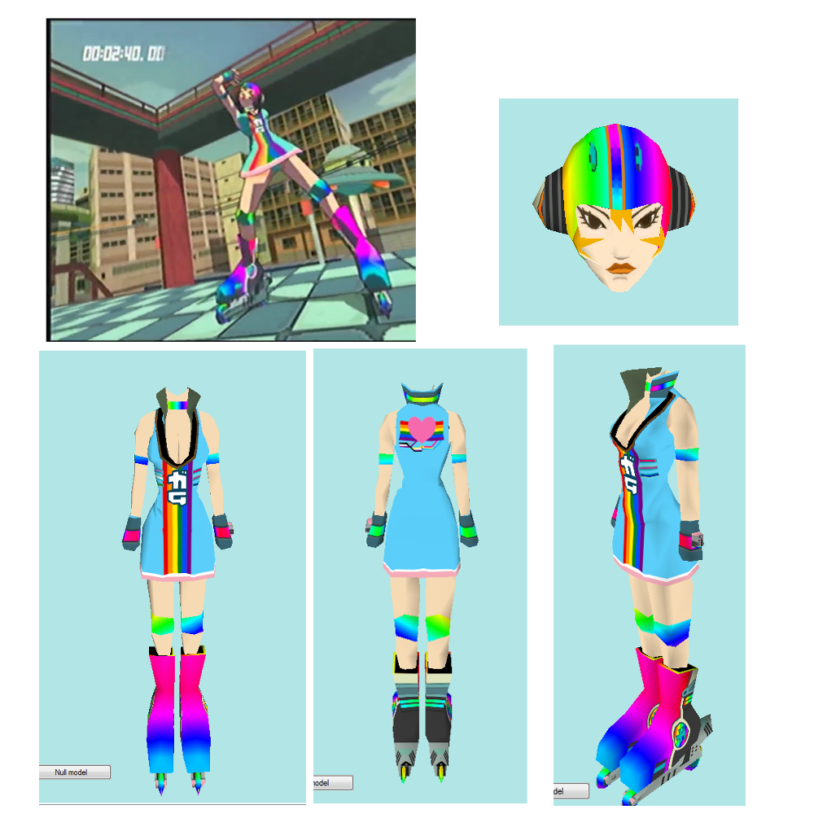

To use this mod, you will need a modded xbox that can play games from its hardrive. there are various methods of doing this with documentation online, and general knowledge of using FTP and playing game backups. Alternatively, yu can just use an emulator. As of June 2019, Cxbx-Reloaded is capable of running JSRF in a playable state https://github.com/Cxbx-Reloaded/Cxbx-Reloaded (Sorry if this link is dead in the distant future)

Anyway, here's what you need to do:
1) Extract the modified Gum.dat and replace the stock Gum.dat in the JSRF files. The directory within the JSRF file structure is Media/Player
    -If you're playing on emulator, you're good to go.
2) On the xbox, you must delete Gum.dat from the cache is you've ever played JSRF on it before. You should find another "Media" folder in one of the xbox's other drive letter volumes. Mine is in the "X"partition, but there are a few others it may show up in. You do not need to delete the entire cache, just Gum.dat from Media/Player. If you do not do this step, the game will just load the original texture from the cache instead of the new one from the game files.

That's it, happy hacking

The src folder contains the working files I used to edit gum's 3 texture maps; feel free to edit them, etc 
